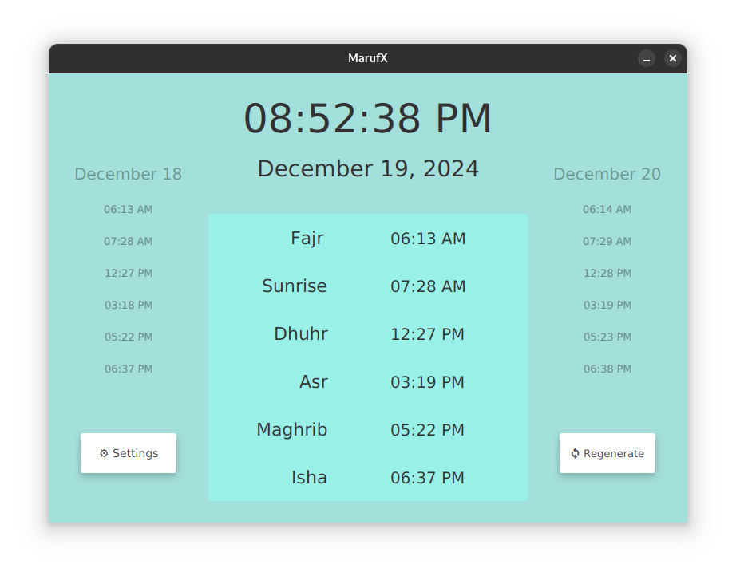
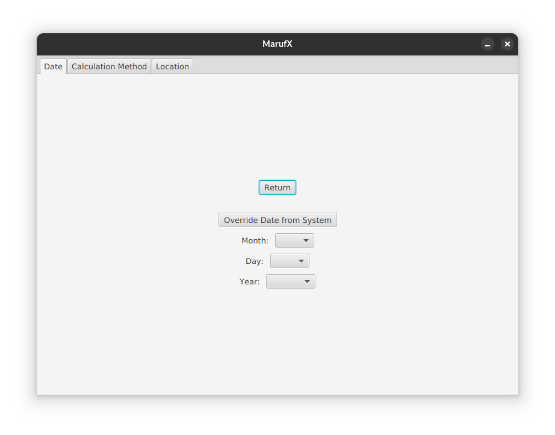

# MarufX
### An Islamic Prayer Times Program
|  |
|:--:|
|*Default Launch*|

|  |
|:--:|
|*Settings Menu*|
### Purpose
- The original idea behind this program was to create a simple utility that doesn't require constant internet connectivity, does what it needs to do and not much else
- A lot of the other salah programs out there rely on fetching data from an API, such as the [AlAdhan Prayer Times API](https://aladhan.com/prayer-times-api), while these APIs work well, they are not necessary
- Calculating islamic prayer, or *salah*, times is really just a set of fairly common astronomical equations that we can manipulate to get what we need
### *How It Works*
- All the prayer times are derived from the position of the Sun, which we can approximate
- For a deeper look into the math behind these, view the sources included below and a more in depth set of calculations will be included in this repository in the future
- This way, the only information that is required in this type of calculation is coordinates in latitude and longitude
### *When It Falls Apart*
- The kind of calculation used here, relying on the position of the sun falls apart in high altitude conditions and some others, there are many methods to compensate for this, but *MarufX* does not compensate for these, at the moment
### TO-DO
- Package as binary
- Exception checking for no internet connectivity
- Various Graphical Bugs
- Fix buggy location query GUI interface
- Fix year selection in settings
- Hook into system notifications and potentially task scheduler
- Add altitude compensation methods
- Add qibla feature using coordinates and length approximation

##### Related Links
- [Radhi Fadlillah Blog](https://radhifadlillah.com/blog/2020-09-06-calculating-prayer-times/)
- [PrayTimes.org Manual](http://praytimes.org/manual)
- [US NOAA - Solar Calculator](https://gml.noaa.gov/grad/solcalc/)
- [SunCalc.org](https://www.suncalc.org/)
- [AlAdhan API](https://aladhan.com/prayer-times-api)
